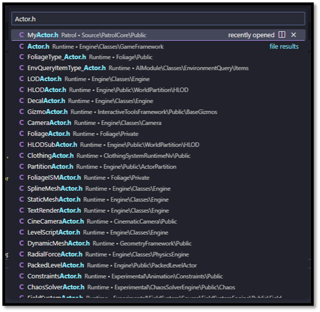
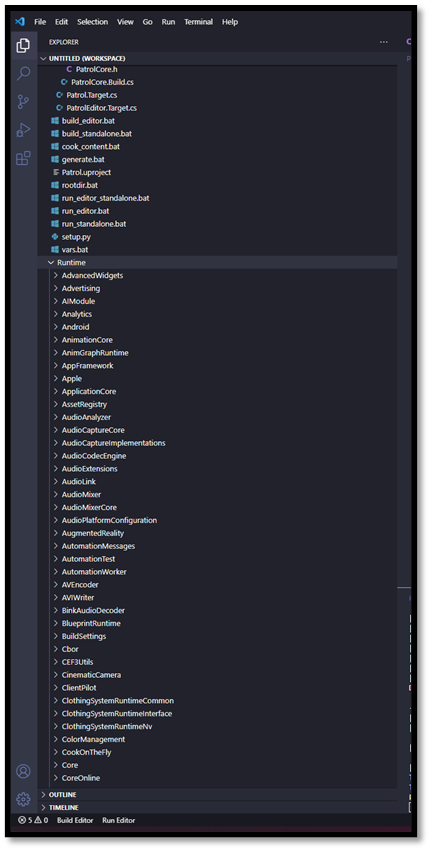
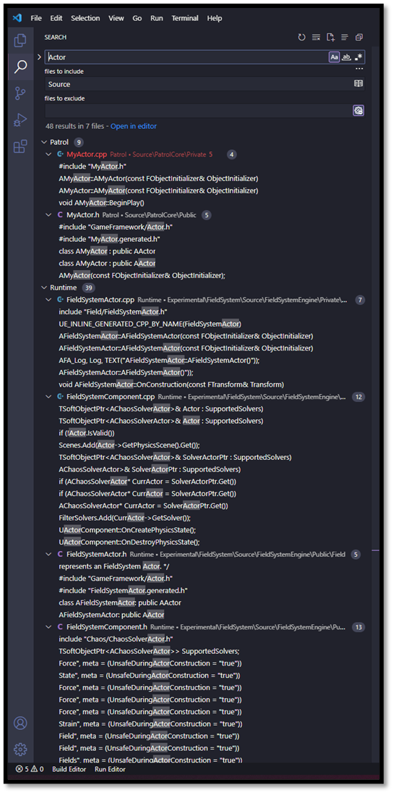
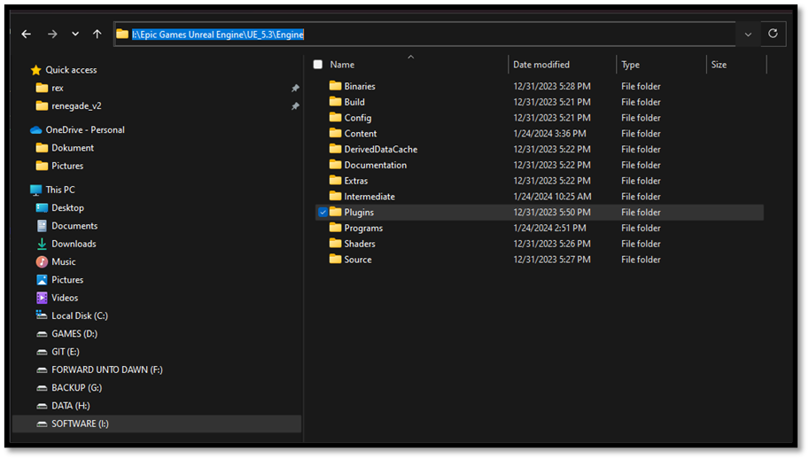

# Additional Workflow Items

## Looking for files

- If you hit Ctrl+P, you can quickly browse to any file that's been included in the project.

## Creating a Code workspace

- You can add ${unreal}/Source/Runtime directory to your project workspace so you have the Unreal source code at your fingertips.

If we add UE's ${unreal}/Engine/Source/Runtime directory, then we'll also have the Engine source at our fingertips. The key distinction here is that where Visual Studio tries to be smart, VS Code just tries to be fast. With Visual Studio, you're dealing with IntelliSense, which has to parse the entire Engine codebase and run extensive static analysis, and then it has to reason about that codebase while working around the fact that huge chunks of it rely on a custom code generation process... and if you ask me, expecting it to be reliably correct and responsive is just too much to ask. Back when I was using Visual Studio, I found I couldn't rely on IntelliSense, and I'd end up just searching through the API documentation all the time. But the code itself contains the exact same documentation you can cut out the middle-man and Ctrl+P your way straight to an answer, faster than it takes for an IntelliSense completion window to appear. This approach keeps you in the driver's seat.

## Looking for symbols

- Use CTRL + SHIFT + F to search the entire codebase to see how a symbol is used or referenced

## Plugin directory

- Use the ${unreal}/Engine/Plugins directory as a reference on how to structure Unreal modules within your project

A good source of example code is the Engine Plugins directory. If we limit our search there, we can find usage examples that are set up in the same way our project code should be.

## Documentation

- Use the Engine Source Code as documentation

I've found that if you treat the Engine source as documentation in and of itself, and if you optimize your workflow for browsing that source, you'll gain a much more intuitive understanding of it over time.