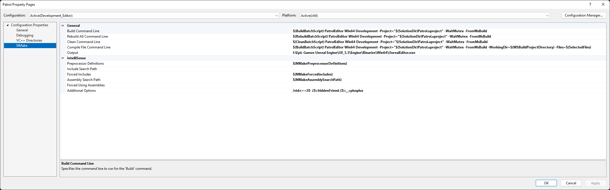
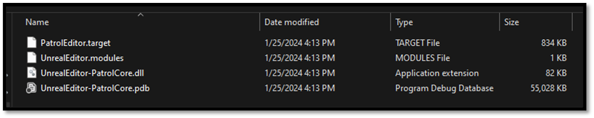

# Build an Unreal Project from Scratch

Now that we have an entry point to our project by setting up our primary module we have a project that is ready to be build from Source. We have done all this without the usage of Visual Studio or Unreal Editor, not because they are bad tools but just because this gives us a chance to see what's happening under the hood. Unreal uses the Visual C++ compiler and linker and it recommends Visual Studio as an officially supported IDE, but it does not actually use Microsoft's build system. Instead **Unreal has it's own cross-platform build system,** which is why we need to write those C# files to configure our target and its modules. When you generate Visual Studio project files, those solution and project files aren't actually an essential part of the build. They're just **Visual Studio compatible frontend for Unreal's build process.** If we navigate to `{UE-Install-Directory}/Engine/Build/BatchFiles` directory we can see a file called Build.bat. This just calls UnrealBuildTool.exe, which invokes builds. When you build your project in Visual Studio, it's essentially just running this Batch file. 



This batch file has 4 essential steps:
- **Setting up the environment** It checks if the batch file exists in the expected directory and sets up the environment for the build process.
- **Building the UnrealBuildTool** It verifies the presence of the UnrealBuildTool and compiles it if necessary, either using Visual Studio or dotnet, depending on the context.
- **Running the UnrealBuildTool** It executes UnrealBuildTool with the provided arguments, which typically include the game name, platform name, configuration name, and any additional arguments required for the build process.
- **Error Handling** It includes error handling mechanisms to detect and report errors that may occur during the build process, such as missing dependencies, compilation failures, or missing files.

## Unreal Build Tool

The **Unreal Build Tool** (UBT) is a crucial component of the Unreal Engine, **managing the process of building Unreal source code across a variety of build configurations.** The Unreal Engine supports a wide range of platforms, including Windows, macOS, Linux, iOS, Android, consoles like PlayStation and Xbox, and VR/AR devices. UBT plays a central role in managing the complexities of building projects for these diverse platforms, **abstracting away much of the platform-specific details and providing a unified build system. Its primary responsibility lies in compiling, linking, and managing the code and assets integral to Unreal Engine projects.** As we already discussed Unreal is split into many modules. Each module has a .build.cs file that controls how it is built, including options for defining module dependencies, additional libraries, include paths, etc. By default, these modules are compiled into DLLs and loaded by a single executable (You can also choose to build a monolithic executable in the BuildConfiguration.cs file). Understanding UBT and its role within the Unreal Engine ecosystem is essential for developers working with the platform. It empowers developers to effectively manage the intricacies of building Unreal projects, facilitating efficient development workflows and optimized project outcomes. Mastery of UBT not only enhances technical proficiency but also underscores foundational principles in software engineering and project management. Anyway, an entire article could be written about UBT. For more information about UBT I would like to advise you to read the [Official Documentation](https://docs.unrealengine.com/4.27/en-US/ProductionPipelines/BuildTools/UnrealBuildTool/).

## Using UBT

We've already established that we don't require Visual Studio to build our project, we can still leave Visual Studio out of the equation when it comes to building our project while still making use of UBT. All we have to do is invoke Build.bat and pass in a few arguments. We need to tell it which Target we want to build, then we need to give it a platform and a build configuration. Then we just pass in the path to the .uproject file, and we can kick off the build. 

- Open your terminal
    - CTRL + Tilde (~)
    - Type `{UE-BatchFiles}/Build.bat`
        - `I:\Epic Games Unreal Engine\UE_5.3\Engine\Build\BatchFiles\Build.bat`
    - Define a Target that you would like to build
        - `{projectname}Editor`
    - Define a Platform that would like to build for
        - `Win64`
    - Define a build configuration
        - `Development`
    - Define a path to the .uproject
    - Define `-waitMutex` and `-NoHotReload`

The full command should look like this: 

```shell
{UE-BatchFiles}/Build.bat PatrolEditor Win64 Development “{project_path}/Patrol.uproject" -waitMutex -NoHotReload
```
*Note: if your path towards the batch file contains spaces encapsulate it with (“) and start your command with a “&“*
```shell
& "{UE-BatchFiles}/Build.bat" PatrolEditor Win64 Development “{project_path}/Patrol.uproject" -waitMutex -NoHotReload
```

A limitation of the UnrealBuildTool is that it can only build 1 project at a time, so we pass in `waitMutex` to make sure if there is an exception thrown when multiple builds have been started at the same time. Additionally, we are not going to be concerned with hot reloading our code when developing our project so lets specify `NoHotReload` as well.

Once the build gets going, we start getting build artifacts in the Intermediate directory. Eventually, Unreal Header Tool parses our source and spits out generated source files, then everything gets compiled to object code, and then finally our module is linked together into a DLL that the editor can load. We can see that DLL in the Binaries directory this file contains all the code we've written in our {modulename}Core module, in a compiled binary form. Next to that is the corresponding PDB, or symbol file this essentially contains debugging information so that symbols in the compiled binary version of our code can be traced back to the corresponding functions, variables, and other identifiers in the source code. We also get a .modules file, which is just a bit of metadata telling the editor which DLLs should be loaded for this module, and which Engine version those DLLs were compiled against this is why you'll get an error if you build editor binaries on one version of Unreal, then try to open them with a different version. There's also a .target file, which is just more metadata spit out by the build system which is not important for us.



## Wrap up

That's it for the builing our project, in the [next section](./opening_unreal_project_from_scratch.md) everything will come togheter, and we will start opening our project in Editor, Editor Standalone and Running our game. 