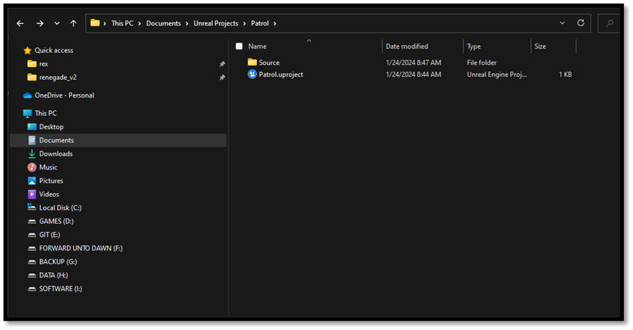
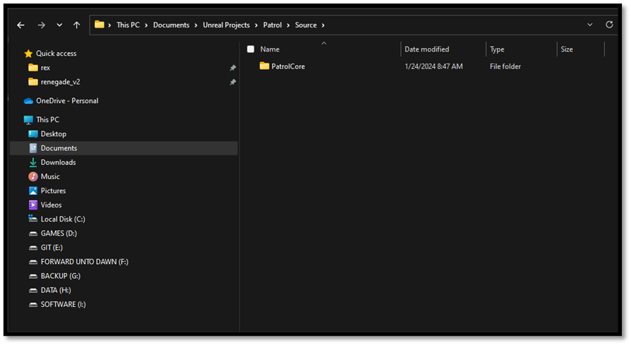
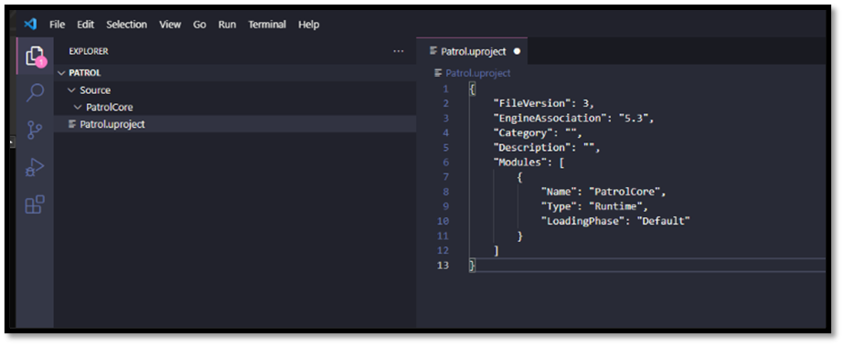
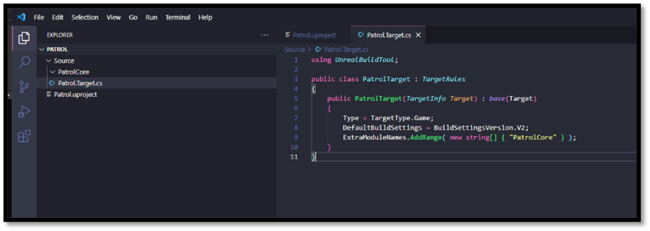
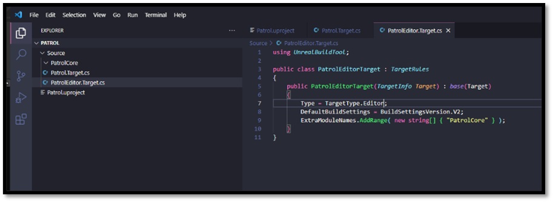

# Creating an Unreal Project from Scratch

Let's peek behind the scenes to understand how project files and build processes interconnect. Instead of diving straight into the complexities, let me guide you through setting up a new project in Unreal Engine from scratch.

Begin by carving out a cozy space for your project on your disk drive. When it comes to naming your project, don't overthink it. This name isn't etched in stone as part of your public-facing brand—it merely serves as a convenient identifier. A short codename suffices.

- Set up a folder where we'll work our magic.
- Give your project a name.
    - Again, keep it simple, nothing too crazy.

We're gonna start with a .uproject file to lay down the basics and we'll need a Source folder for all our C++ goodness.

- Drop a .uproject file in the main folder.
- Make a Source folder in there too.




## The .uproject File

A .uproject file, short for **"Unreal Project File," serves as the entry point and configuration file for an Unreal Engine project.** It's a JSON-formatted file that contains essential information about the project, such as its name, description, and the list of modules and/or plugins it uses. An Unreal Project File is **recognized by the UnrealVersionSelector**, this setting is stored in the your registry by Unreal when you installed it. The following attributes can be found within a .uproject file:

| Property                          | Description                                                                                                                                                   |
|----------------------------------|-----------------------------------------------------------------------------------------------------------------------------------------------------------     |
| **FileVersion**                      | Descriptor version number.                                                                                                                                 |
| **EngineAssociation**                | Specifies the engine to open the project with. <br> Allows for opening the correct engine version when double-clicking on a project file. <br> Differentiates between editor versions for upgrade/downgrade UI flow. <br> For Launcher users, it indicates a stable version like "5.0" or "5.1". <br> For Perforce or Git users, it's left blank, allowing determination of the engine based on the directory hierarchy. <br> For source build users with a foreign project, uses a random identifier for engine mapping. <br> For users with the engine mounted through a Git submodule, can be manually edited as a relative path.                                                                                        |
| **Category**                         | Category to show under the project browser.                                                                                                                |
| **Description**                      | Description to show in the project browser.                                                                                                                |
| **Modules**                          | List of all modules associated with this project.                                                                                                          |
| **Plugins**                          | List of plugins for this project, which may be enabled or disabled.                                                                                        |
| **TargetPlatforms**                  | Array of platforms that this project is targeting.                                                                                                         |
| **EpicSampleNameHash**               | A hash used to determine if the project was forked from a sample.                                                                                          |
| **PreBuildSteps**                    | Custom steps to execute before building targets in this project.                                                                                           |
| **PostBuildSteps**                   | Custom steps to execute after building targets in this project.                                                                                            |
| **Enterprise**             | Indicates if this project is an Enterprise project.                                                                                                                  |
| **DisableEnginePluginsByDefault**  | Indicates that enabled by default engine plugins should not be enabled unless explicitly enabled by the project or target files.                             |


*Note:*

*When project file association is not working properly one can simply run **UnrealVersionSelector.exe -fileassociations** from the Unreal Engine Binaries.*
*You could refer to the following files for proper debugging capabilities.*
- *[UnrealVersionSelector.cpp](https://github.com/EpicGames/UnrealEngine/blob/release/Engine/Source/Programs/UnrealVersionSelector/Private/UnrealVersionSelector.cpp#L40)*
- *[DesktopPlatformWindows.cpp](https://github.com/EpicGames/UnrealEngine/blob/release/Engine/Source/Developer/DesktopPlatform/Private/Windows/DesktopPlatformWindows.cpp#L491https://)*

*For more information about the Project Descriptor please visit the following files:*
- *[ProjectDescriptor.h](https://github.com/EpicGames/UnrealEngine/blob/release/Engine/Source/Runtime/Projects/Public/ProjectDescriptor.h)*
- *[ProjectDescriptor.cpp](https://github.com/EpicGames/UnrealEngine/blob/release/Engine/Source/Runtime/Projects/Private/ProjectDescriptor.cpp)*

The following is an example descriptor of an Unreal Project:

```json
{
	"FileVersion": 3,
	"EngineAssociation": "5.3",
	"Category": "",
	"Description": "",
	"Modules": [
		{
			"Name": "PatrolCore",
			"Type": "Runtime",
			"LoadingPhase": "Default"
		},
		{
			"Name": "PatrolGame",
			"Type": "Runtime",
			"LoadingPhase": "Default"
		}
	]
}
```

### Modules

Modules are **the basic building block of Unreal Engine's software architecture.** These encapsulate specific editor tools, runtime features, libraries, or other functionality in standalone units of code.

When the project file is loaded into memory it is stored within a `FProjectDescriptor` which contains all the information contained within a .uproject file. Each .uproject file **when containing source files** is accompanied with a **list of modules and/or plugins** available to the project. Modules have their own set of attributes as specification when and how they should be loaded by the engine, all information is stored within a structure called `FModuleDescriptor`. The following attributes can be found within a module definition:

| Property                        | Description                                                                                                                                                   |
|---------------------------------|-------------------------------------------------------------------------------------------------------------------------------------------------------------- |
| **Name**                            | Name of this module.                                                                                                                                          |
| **Type**                            | Usage type of the module.                                                                                                                                     |
| **LoadingPhase**                    | Specifies when the module should be loaded during the startup sequence.                                                                                       |
| **PlatformAllowList**               | List of allowed platforms for the module.                                                                                                                     |
| **PlatformDenyList**                | List of disallowed platforms for the module.                                                                                                                  |
| **TargetAllowList**                 | List of allowed build target types for the module.                                                                                                            |
| **TargetDenyList**                  | List of disallowed build target types for the module.                                                                                                         |
| **TargetConfigurationAllowList**    | List of allowed build configurations for the module.                                                                                                          |
| **TargetConfigurationDenyList**     | List of disallowed build configurations for the module.                                                                                                       |
| **ProgramAllowList**                | List of allowed programs for the module.                                                                                                                      |
| **ProgramDenyList**                 | List of disallowed programs for the module.                                                                                                                   |
| **AdditionalDependencies**          | List of additional dependencies required for building this module.                                                                                            |


*Note:* 
*For more information about the Module Descriptor please visit the following files:*
- *[ModuleDescriptor.h](https://github.com/EpicGames/UnrealEngine/blob/release/Engine/Source/Runtime/Projects/Public/ModuleDescriptor.h)*
- *[ModuleDescriptor.cpp](https://github.com/EpicGames/UnrealEngine/blob/release/Engine/Source/Runtime/Projects/Private/ModuleDescriptor.cpp)*

The following is an example descriptor of a single module:
This does not funciton on it's own, it needs to be encapsulated by either an Unreal Project or an Unreal Plugin

```json
{
  "Name": "PatrolCore",
  "Type": "Runtime",
  "LoadingPhase": "Default"
}
```

### Plugins

Last architectural piece of the Unreal Engine are plugins, due to the complexity of UE plugins I will not go into full detail here rather give you a brief overview of what they are and how to use them. 

Plugins are **collections of code and data that developers can easily enable or disable within the Editor on a per-project basis.** Plugins can add runtime gameplay functionality, modify built-in Engine features (or add new ones), create new file types, and extend the capabilities of the Editor with new menus, tool bar commands, and sub-modes. Many existing UE4 subsystems were designed to be extensible using plugins.

The main difference between modules and plugins is that plugins (usually) will contain one or more modules, and can also optionally contain their own content. So in a sense **they’re a higher level construct than a module. You can see them as a sub-project within your main project so to speak.** Each plugin if they have source code will have their own Source folder, with the accompanied Binaries folder that contains the compiled code for that plugin. They can have their own Content folder that contains Assets specific for that Plugin. 

Last I'll leave you with an overview of some of the more common attributes of a Plugin that you need to be aware of, this data is stored in a structure called `FPluginDescriptor`, you'll notice that they are quite similar to the ones of an Unreal Project:

| Property          | Description                                                                                                                                                                 |
|-------------------|---------------------------------------------------------------------------------------------------------------------------------------------------------------------        |
| **FileVersion**       | Descriptor version number.                                                                                                                                                  |
| **Version**           | Version number for the plugin. The version number must increase with every version of the plugin, so that the system can determine whether one version of a plugin is newer than another, or to enforce other requirements. This version number is not displayed in front-facing UI. Use the VersionName for that.                                                                                                                                                    |
| **VersionName**       | Name of the version for this plugin. This is the front-facing part of the version number. It doesn't need to match the version number numerically, but should be updated when the version number is increased accordingly. |
| **FriendlyName**      | Friendly name of the plugin.                                                                                                                                                |
| **Description**       | Description of the plugin.                                                                                                                                                  |
| **Category**          | The name of the category this plugin.                                                                                                                                       |
| **DocsURL**           | Documentation URL string.                                                                                                                                                   |
| **MarketplaceURL**   | Marketplace URL for this plugin. This URL will be embedded into projects that enable this plugin, so we can redirect to the marketplace if a user doesn't have it installed. |
| **SupportURL**        | Support URL/email for this plugin.                                                                                                                                          |
| **EngineVersion**     | Version of the engine that this plugin is compatible with.                                                                                                                  |
| **EnabledByDefault** | Whether this plugin should be enabled by default for all projects.                                                                                                           |
| **CanContainContent**| Can this plugin contain content?                                                                                                                                             |
| **IsBetaVersion**    | Marks the plugin as beta in the UI.                                                                                                                                          |
| **Installed**         | Signifies that the plugin was installed on top of the engine.                                                                                                               |
| **Modules**           | List of all modules associated with this plugin.                                                                                                                            |


For more information about Plugins I will refer you to the [Official Unreal Documentation](https://docs.unrealengine.com/5.1/en-US/plugins-in-unreal-engine/) about Plugins.

*Note:* 
*For more information about the Plugin Descriptor please visit the following files:*
- *[PluginDescriptor.h](https://github.com/EpicGames/UnrealEngine/blob/release/Engine/Source/Runtime/Projects/Public/PluginDescriptor.h)*
- *[PluginDescriptor.cpp](https://github.com/EpicGames/UnrealEngine/blob/release/Engine/Source/Runtime/Projects/Private/PluginDescriptor.cpp)*

The following is an example descriptor of an Unreal Plugin

```json
{
	"FileVersion": 3,
	"Version": 1,
	"VersionName": "4.25.0",
	"FriendlyName": "Advanced Locomotion System Community",
	"Description": "Performance optimized community version of LongmireLocomotion's Advanced Locomotion System V4",
	"Category": "Animation",
	"CreatedBy": "Doga Can Yanikoglu",
	"CreatedByURL": "https://github.com/dyanikoglu",
	"DocsURL": "https://github.com/dyanikoglu/ALS-Community",
	"SupportURL": "https://github.com/dyanikoglu/ALS-Community/issues",
	"EngineVersion": "5.3.0",
	"EnabledByDefault": true,
	"CanContainContent": true,
	"IsBetaVersion": false, 
	"IsExperimentalVersion": false,
	"Installed": false,
	"Modules": [
		{
			"Name": "ALSV4_CPP",
			"Type": "Runtime",
			"LoadingPhase": "Default",
			"AdditionalDependencies": [
				"Engine",
				"AIModule",
				"GameplayTasks",
				"PhysicsCore"
			]
		}
	],
	"Plugins": [
		{
			"Name": "Niagara",
			"Enabled": true
		},
		{
			"Name": "EnhancedInput",
			"Enabled": true
		}
	]
}
```

## Populating the .uproject file

Now that we understand what a Unreal Project file is and how it is structured let's complete our own.

For those who **setup the environment variables**, this should open up VS Code within the current directory

- Open VS Code within your project directory
  - CTRL + L ( to focus the address bar )
  - Type: code .
  - Press Enter

For those who have **not setup the environment variables**, this should open up VS Code within the current directory
- Open VS Code within your project directory
  - Right Click somewhere within your folder
  - Select: Show more options
  - Select: Open with Code

- Create a {modulename}Core sub directory within the Source directory
  - A good convention for naming modules would be to start each module with your {projectname}
    - {projectname}Core
    - {projectname}AI
    - {projectname}GamePlay



- Open the .uproject file
- Type: **uuproj**
  - This should trigger a snippet that we setup earlier
- Verify the EngineAssociation is correct



*Note:*
*Additional modules and/or plugins that are required for your project also go here.*
*The following is an example when multiple modules are required:*

```json
{
	"FileVersion": 3,
	"EngineAssociation": "5.3",
	"Category": "",
	"Description": "",
	"Modules": [
		{
			"Name": "PatrolCore",
			"Type": "Runtime",
			"LoadingPhase": "Default"
		},
		{
			"Name": "PatrolGame",
			"Type": "Runtime",
			"LoadingPhase": "Default"
		}
	]
}
```

## Build Targets

Now that the initial setup for our project is setup we have can move on to setting up a build target. We will require a Target Rules Definition file for this. It will tell the Unreal build system how to build our project. Supported target types are as followed:

| Type    | Description                                                                                          |
|---------|------------------------------------------------------------------------------------------------------|
| **Game** | A standalone game which requires cooked data to run.                                                 |
| **Client** | Same as Game, but does not include any server code. Useful for networked games.                      |
| **Server** | Same as Game, but does not include any client code. Useful for dedicated servers in networked games. |
| **Editor** | A target which extends the Unreal Editor.                                                           |
| **Program** | A standalone utility program built on top of the Unreal Engine.                                      |

Targets are declared through C# source files with a .target.cs extension, and are stored under your project's Source directory. **Each .target.cs** file declares a class deriving from the [TargetRules](https://github.com/EpicGames/UnrealEngine/blob/release/Engine/Source/Programs/UnrealBuildTool/Configuration/TargetRules.cs) base class, and sets **properties controlling how it should be built** from its constructor. When asked to build a target, UnrealBuildTool will compile your target.cs file and construct the class inside it to determine its settings.

The **name of the class must match the name of the file** it's declared in **followed by 'Target'** (so for example, Patrol.target.cs defines the class 'PatrolTarget'). They typical structure of a target file is as followed:

```Csharp
using UnrealBuildTool;
using System.Collections.Generic;

public class PatrolTarget : TargetRules
{
    public PatrolTarget(TargetInfo Target) : base(Target)
    {
        Type = TargetType.Game;

        // Other properties go here
    }
}
```

Numerous properties are accessible from the base class, the details of which are too extensive to cover within this page. For a comprehensive list of all available properties, I recommend consulting the [Official Unreal Documentation](https://docs.unrealengine.com/4.27/en-US/ProductionPipelines/BuildTools/UnrealBuildTool/TargetFiles/) or examining the [Source Code](https://github.com/EpicGames/UnrealEngine/blob/release/Engine/Source/Programs/UnrealBuildTool/Configuration/TargetRules.cs) (Regrettably, not all properties are exhaustively described within the documentation.). However, I'd like to direct your attention to two properties that may prove particularly useful.

- **DefaultBuildSettings** Specifies the engine version to maintain backwards-compatible default build settings with (eg. DefaultSettingsVersion.Release_4_23, DefaultSettingsVersion.Release_4_24). Specify DefaultSettingsVersion.Latest to always use defaults for the current engine version, at the risk of introducing build errors while upgrading.
- **ExtraModuleNames** List of additional modules to be compiled into the target.

## Populating the Target Rules

As mentioned the Target Rule Definitions need to be stored under your project's Source directory. So let's do that now.

- Navigate to your Source directory
- Create a new Target Rules file
  - {projectname}{modulename}.Target.cs
  - We can use the snippet **umt** to autocomplete this file



- Navigate to your Source directory again
- Create a new Target Rules file
  - {projectname}{modulename}Editor.Target.cs
  - We can use the snippet **umt** to autocomplete this file
- Change the Target Type within this Editor Target Rules file to "Editor" instead of "Game"



## Wrap up

That's it for the creation of our project, in the [next section](./setup_unreal_project_from_scratch.md) we will discuss how we can setup our Unreal Project properly by adding source code and Build Rule Definition files. Within this section we learned that the .uproject file tells Unreal Editor that it can open this directory as an Unreal Project using the specified version. It also specifies that when the Editor opens this project, it should find and load the DLL for the module called "PatrolCore". The .Target.cs file tells the Unreal Build System that it can build all the necessary code for this project by building the "PatrolCore" module. 