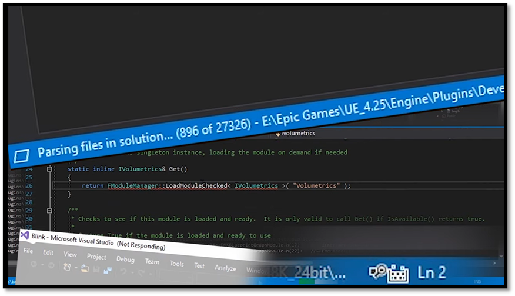

# Introduction

You don’t need to use Visual Studio to write game code in Unreal. You can generate a solution file, crack it open, and start writing code. That’s the officially supported workflow, and it’s a perfectly valid approach. It’s great for beginners since it’s an easy way to get started. However, I’ve found it also leads a lot of people to miss out on an opportunity to form an understanding of how an Unreal project fits together and how the build system works, and let’s face it, the Visual Studio experience is not everybody’s cup of tea.

Within this document I will show you how you can create an Unreal project from scratch with just a text editor. I will explain how we can build and run that project from the command line. After going through this document I hope that you get a basic understanding on what happens when you build an Unreal project. If down the line you are ever faced with a wall of cryptic error messages, you’ll have a better idea of how to diagnose the problem and get moving again.

But first let us [setup the environment](./development_setup.md) I use to work within Unreal.