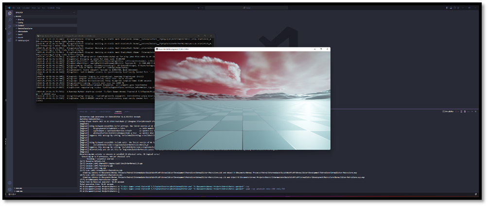

# Open an Unreal Project from Scratch

We've pieced together our project using the .uproject file and Target Rule Definitions. We've got our entry point sorted by making use of the primary module and declared the dependencies within Module Build Rules. After all that, we've asked UBT to build our project and conjured up a DLL that the editor can load. Now we can let the Designers, Artists, and fellow Developers loose to tinker, tweak, and test-drive our creation.

## Open in Editor

To open your project: 

- Run ${Unreal-Install-Dir}/Engine/Binaries/Win64/UnrealEditor.exe
- Define the path to your .uproject
- Define -log

The full command should look like this: 

```shell
{UE-Bin}/UnrealEditor.exe “{project_path}/Patrol.uproject" -log
```
*Note: if your path towards the batch file contains spaces encapsulate it with (“) and start your command with a “&“*

Since this is our first time booting up the project, we can see the Editor writing out some new files in our project directory.

- **Saved** contains logs and other files created at runtime, either by the game or the editor
- **Derived Data Cache** where the editor can cache data that it has built for specfic assets
- **Content** which maps directly to our project's assets in the Content Browser
- **Config** project configuration changes have been stored in .ini files

### Derived Data Cache

Small word about Derived Data Cache (DDC) folder, Many Unreal Engine Assets require additional "derived data" before they can be used. (A simple example would be a Material that has a shader). Before the Material can be rendered, the shader must be compiled for the platform the editor is running on. Because the derived data is large, and at times may need regenerating, it is not checked into source control. Instead it's kept in the Derived Data Cache (DDC). Depending on how your project and system are configured, there can be several DDC caches in a hierarchy that ranges from fast to slow. When assessing derived data, your system will do the following to determine how quickly it can access it:

- When a piece of derived data is needed, the fastest cache is checked first, then the next fastest, and so on, until the data is found.
- When the data is found, it is copied into the fastest local cache so that it is quicker to access next time.
- If the data is not found, then it is first generated, then asynchronously copied into the caches so it is available for you (and potentially your team) in the future.

Content stored in the DDC is disposable, and can be regenerated at any time using the data stored in the .uasset file. Storing these derived formats externally makes it possible to easily add or change the formats used by the engine without needing to modify the source Asset file.

For more information about DDC please visit the [Official Documentation](https://docs.unrealengine.com/5.3/en-US/derived-data-cache/).

### Altering our project

As we get ready to showcase our project, I'm going to shake things up a bit and tweak the defaults to give it some extra flavor. When we fire up the "Standalone Editor" and "Standalone Game" for testing, we'll be making sure our special map and engine settings are all loaded up correctly. To view the changes I made please navigate to the following [page](./altering_the_project.md).

## Open in Standalone Editor

Opening the Editor is cool, but as a developer we might not always need full control of the Editor this is why we can specify the `-game` flag to the previously defined command mentioned in the "Open in Editor" section. Like any program the Unreal Editor accepts different types of command-line arguments. When passing it different arguments the application (in this case the Unreal Editor) will react differently. Previously we only mentioned the command-line argument `-log` to display a log window while the application is running. When we specify the `-game` flag we ask the Editor to launch itself as a game client instead of the full application. 

Several useful commands to remember when running in Standalone mode are as followed:

| Command           | Type           | Description                                                                                                      |
|-------------------|----------------|------------------------------------------------------------------------------------------------------------------|
| **-log**              | Flag           | Display a log window while the client or server is running.                                                     |
| **-game**             | Flag           | Mode flag to launch game client.                                                                                  |
| **-windowed**         | Flag           | Launch the client in windowed mode. Use in conjunction with -ResX=<HORIZONTAL_RES> -ResY=<VERTICAL_RES>.         |
| **-fullscreen**       | Flag           | Launch the client in full-screen mode.                                                                           |
| **-ResX=<HORIZONTAL_RES> -ResY=<VERTICAL_RES>** | Key-Value Pair | Specify the horizontal (X) and vertical (Y) resolution size for a client. Example: -ResX=1920 -ResY=1080     |

For more information about how to create custom command line arguments, customize command line arguments or other types of command line arguments such as graphics command line arguments please visit the [Official Documentation](https://docs.unrealengine.com/5.3/en-US/command-line-arguments-in-unreal-engine/).

To run our the editor as a single game client we run the following command: 

```shell
{UE-Bin}/UnrealEditor.exe “{project_path}/Patrol.uproject" -log -game -ResX=1280 -ResY=720
```
*Note: if your path towards the batch file contains spaces encapsulate it with (“) and start your command with a “&“*



This is a fully playable instance of our game. We can fly around and we can use console commands as this is still a development build. This results in a quick way to test out the game in a development setting running from editor binaries. Because we are running from editor binaries we need this full installation of Unreal Engine in order to run the build. When we want to ship our game and avoid people having to install the entire Engine we need a standalone version of our project, that's what our non-editor target is for, in the [next section](./running_a_game.md) we will demonstrate how we can run our game without the Editor attached. 