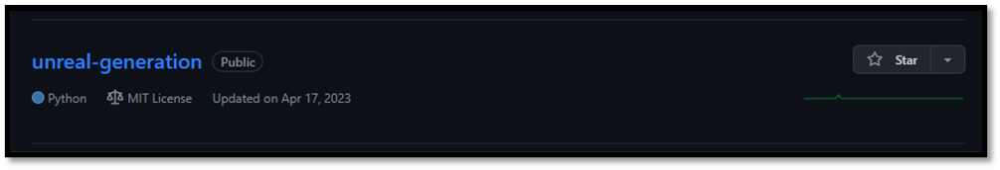
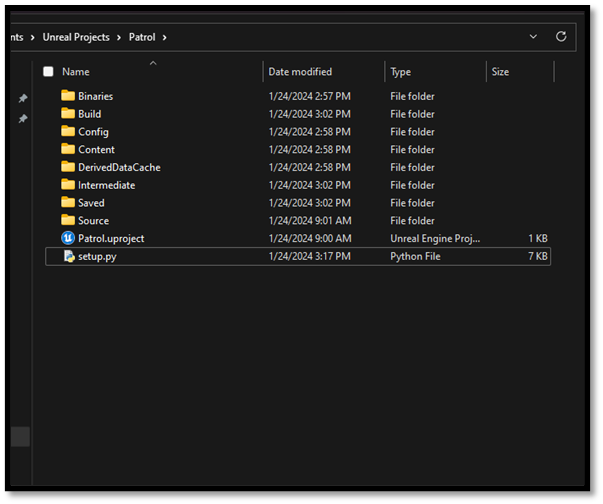
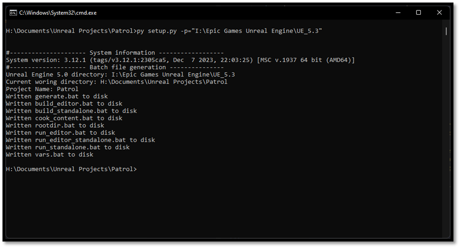
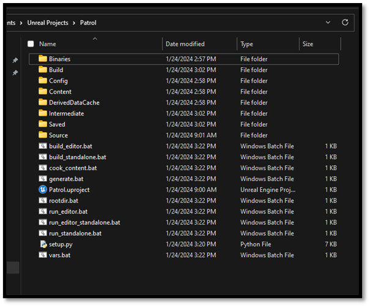
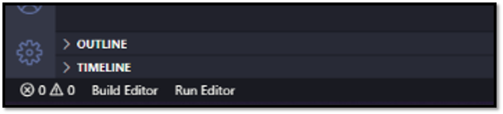

# Quality of Life

In the [previous section](./running_a_game.md) we noticed that there are a lot of commands we have to enter in order to work with Unreal from the command line. This however will only slow us down rather than improve iteration speed. Luckily, we as developers can remedy this by introducing a quick fix and make our own batch files that invoke these commands. I will not bore you with writing these files yourself as we did with the snippets for VS Code you can download a script from [this GitHub repository](https://github.com/Dyronix/unreal-generation) that will setup these files for you. I know batch files aren't really the state of the art in build automation, but we're not doing anything fancy here, so this approach works fine. Feel free to upgrade it to your liking.

## Additional Unreal Batch Files

[](https://github.com/Dyronix/unreal-generation)

-	Download/Clone the repository to disk
-	Copy the contents of the repository (except the .git folder)
-	Go to ${project_path}
-	Paste repository contents



-	Run `setup.py -p=${ue5_path}`
    -	`py setup.py –p="C:\Program Files\Epic Games\UE_5.3"`



-	Batch scripts to run the Unreal commands should have been generated



What's great about using the command-line is that we can easily chain multiple commands together. If we run `build_editor && run_editor`, that will build and if and only if the build succeeds, it'll launch the editor. This lets us jump quickly back and forth between code and editor.

## VS Code Tasks

An extension that was installed in the [development setup](./development_setup.md) chapter was called VS Code Tasks. Now that the batch files have been created we can setup these tasks. You see you can specify certain commands within VS Code without using the terminal. It's like having the "Run" button of Visual Studio but better.



- Create .vscode folder in your {project_directory}
- Add a `tasks.json` file to this folder
- Fill the contents of this file with commands you would like to execute
- Created tasks will end up at the bottom of the IDE

And example of the tasks.json fill looks as followed:

```json
{
    "version": "2.0.0",
    "tasks": [
        {
            "label": "Build Editor",
            "type": "shell",
            "command": "./build_editor.bat",
            "windows": {
                "command": "./build_editor.bat"
            },
            "group": "none",
            "presentation": {
                "reveal": "always",
                "clear": true
            }
        },
        {
            "label": "Run Editor",
            "type": "shell",
            "command": "./run_editor.bat",
            "windows": {
                "command": "./run_editor.bat"
            },
            "group": "none",
            "presentation": {
                "reveal": "always",
                "clear": true
            }
        },
    ]
}
```

Now everything is in place to start working on our new project, in the [next section](./testing_the_setup.md) we will test the setup we created with a simple example.