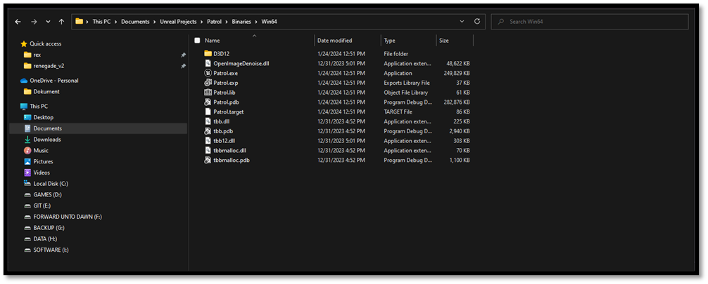
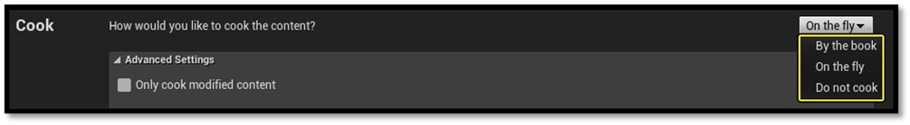
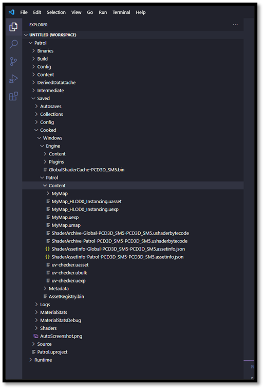
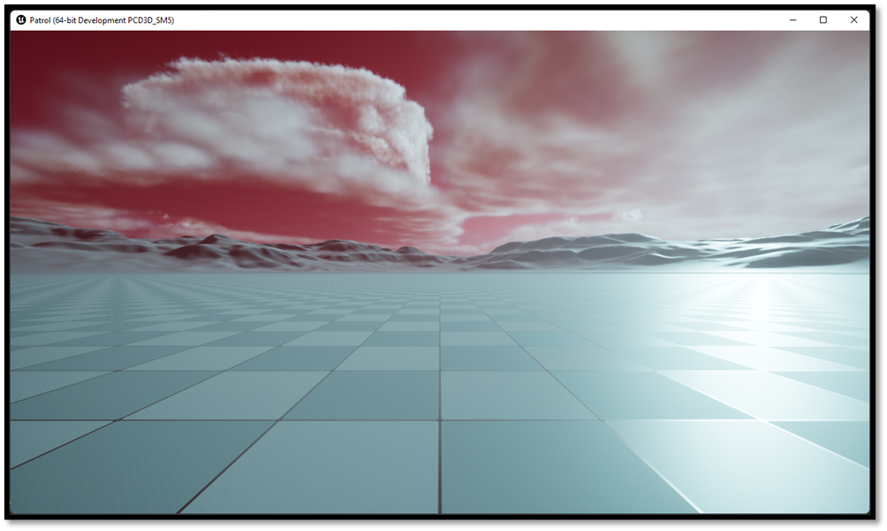

# Running a Game

In the [previous section](./opening_unreal_project_from_scratch.md) we learned how we are able to quickly iterate over our game in a development setting, running from editor binaries. But once your game is complete, you can package a release version for distribution. Before an Unreal project can be distributed to users, it must be properly packaged. Packaging ensures that all code and content is up to date and in the proper format to run on the desired target platform.

## Building a Game

All we must do to run a standalone game is invoke the same build process, passing in our project's Game target instead of its Editor target. This'll run through the same build process, but instead of linking our individual modules into DLL files, it'll link our project against all the required Engine code and generate a single executable that runs our game, with all the editor-specific functionality stripped out. 

- Open your terminal
    - CTRL + Tilde (~)
    - Type `{UE-BatchFiles}/Build.bat`
        - `I:\Epic Games Unreal Engine\UE_5.3\Engine\Build\BatchFiles\Build.bat`
    - Define a Target that you would like to build
        - `{projectname}`
    - Define a Platform that would like to build for
        - `Win64`
    - Define a build configuration
        - `Development`
    - Define a path to the .uproject
    - Define `-waitMutex` and `-NoHotReload`

```shell
{UE-BatchFiles}/Build.bat Patrol Win64 Development “{project_path}/Patrol.uproject" -waitMutex -NoHotReload
```
*Note: if your path towards the batch file contains spaces encapsulate it with (“) and start your command with a “&“*



## Cooking Content

Before running our executable, we must first take the essential step of preparing our content also known as "cooking". **In the realm of Unreal, content assets are stored in specific internal formats,** such as PNG for textures and WAV for audio. However, this content needs to be converted to different formats for the various platforms, either because the platform uses a proprietary format, does not support the format Unreal uses to store the asset, or a more memory- or performance-effective format exists.

This conversion process, **known as "cooking,"** is crucial for the seamless integration of content into the final game. We can start this process either through command-line operations or by utilizing in-editor tools. It's important to note that, for some platforms, all content must undergo the cooking process before it can be used on the device to ensure proper functionality. You should verify with the specifications of the platform they are targeting to ensure compliance with these requirements.

There are **two ways to cook content** for your projects

- **by the book**
- **on the fly**



### By the Book

Cook by the book **performs the entirety of the cook process ahead of time** allowing for the build to deploy the cooked assets all at once rather than as needed while playing the level (if you were using a cook server). This option is useful for developers who are not iterating on individual assets or for those who want the game to perform at full-speed without waiting for a server to deliver the necessary cooked content. Typically, performance testing and playtests will want to use this method.

When performing a cook by the book, there is no extra setup required for the build.

### On the Fly

When you choose to cook content on the fly (COTF), it will **delay cooking it until after the game has been deployed to the platform**. Only the executable and some other basic files are installed, which use network communication with a Cook Server to make requests on-demand as the content is needed. COTF allows for faster iteration for developers who will be making changes to content regularly or those who will only be exploring sections of the game.

To cook on the fly, you will first need to start a Cook Server on a machine which has the full project available to it. This can be either your local machine or a remote server which performs the cook.

Cooking on the fly is specified with the command-line argument: `-cookonthefly`. This launches a server which waits for a game to connect and then serves the cooked data as needed. Requires `-filehostip=<Server IP>` on the game's command line to connect with the server.

For more information on how to cook on the fly please visit the [Official Documentation](https://docs.unrealengine.com/4.27/en-US/SharingAndReleasing/Deployment/BuildOperations/)

### Cooking our Content

Given that we've already executed our entire pipeline via the command line, it's sensible to continue with the cooking process using the same method. We will cook our content `By the book` as we don't have or own a server to hook up.

- Run {UE-Binaries}\UnrealEditor-Cmd.exe
- Define a Target that you would like to build
    - `{projectname}`
-	Define a task
    - `run=cook`
-	Define a target platform
    - `targetplatform=Windows`
        - Additional platforms could be added here: - `targetplatform=Windows+PS4+XboxOne`
        

```shell
{UE-Binaries}\UnrealEditor-Cmd.exe" “${project_path}\Patrol.uproject -run=Cook -TargetPlatform=Windows
```
*Note: if your path towards the batch file contains spaces encapsulate it with (“) and start your command with a “&“*

Other command-line arguments for the cooking process are as followed:

| Option                    | Description                                                                                                                                       |
|---------------------------|-------------------------------------------------------------------------------------------------------------                                      |
| **iterate**               | Specifies the cooker only cook items that are out of date. Without this option, the sandbox directory is deleted and everything is recooked.      |
| **Map**                   | Specifies the map(s) to build.                                                                                                                    |
| **MapIniSection**         | Specifies a section from the ini files which contains map names. Cooker will cook all maps specified in the section specified.                    |
| **UnVersioned**           | Saves all of the cooked packages without versions. These are then assumed to be the current version on load.                                      |
| **CookAll**               | Cooks everything.                                                                                                                                 |
| **Compressed**            | Tells the cooker to compress the cooked packages.                                                                                                 |

After our content is cooked, we end up with a Saved/Cooked directory. This is where our standalone game exectuable will find all the assets it needs to load at runtime



Now we can run our game this should be functionally the same as running from editor binaries, except we're now using cooked data loaded straight from disk the engine isn't building any assets on demand at runtime. We've still built in the Development configuration, though, so we have access to all the same developer tools.

- Run {projectdirectory}/Binaries/Win64/{projectname}.exe
- Define `-log`
- Define `-windowed resx=1280 resy=720`

```shell
${projectdirectory}/Binaries/Win64/{projectname}.exe -log -windowed -resx-1280 -resy=720
```
*Note: if your path towards the batch file contains spaces encapsulate it with (“) and start your command with a “&“*



So sure, we don't need to use Visual Studio to build and run our project. That's cool and all but having to invoke this batch file with these specific arguments is kind of a pain in the a**. In the [next section](./quality_of_life_improvements.md) we will introduce some quality of life improvements to prevent this.