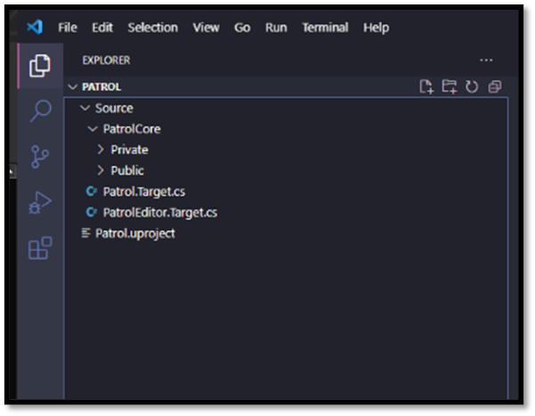
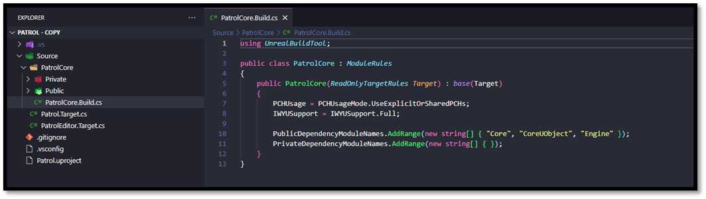
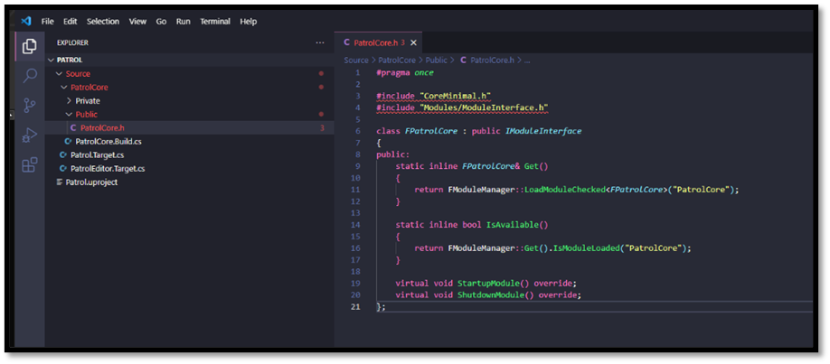
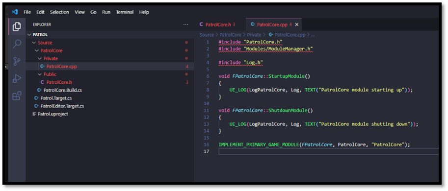
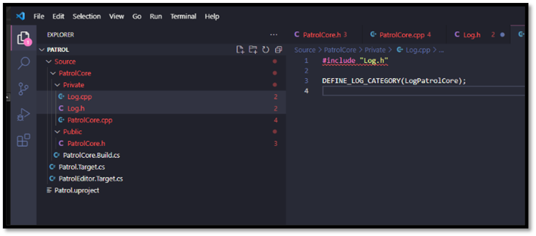

# Setup an Unreal Project from Scratch

In the [previous section](./creating_unreal_project_from_scratch.md) we delved into the essence of a .uproject file and its interaction with the modules and plugins defined within your project. Additionally, we explored Target Rule Definitions, which outline the specifications for building a project. With the project now established, let's proceed to incorporate some source code for the module we've created. By now, you've likely recognized the common convention in Unreal Engine to organize a module's source code into Public and Private subdirectories. The Public directory houses headers that necessitate visibility to other modules, while the Private directory encompasses all implementation details specific to this module.

Let's start by doing that.

- Navigate to your Source/{projectname}{modulename} directory
- Add a Private directory
- Add a Public directory



## Module Build Rules

Before we add any source code we will need an additional C# file, namly the Module Build Rules. As already mentioned **Modules are the building blocks of UE**. The engine is implemented as a large collection of modules, and games supply their own modules to augment them. Each module encapsulates a set of functionality, and can provide a public interface and compile environment (with macros, include paths, and so on) for use by other modules. Modules are declared through C# source files with a .build.cs extension, and are stored under your project's Source directory. The C++ source code belonging to a module is stored next to to the **.build.cs** file, or in subdirectories of it. Each .build.cs file declares a class deriving from the [ModuleRules](https://github.com/EpicGames/UnrealEngine/blob/release/Engine/Source/Programs/UnrealBuildTool/Configuration/ModuleRules.cs) base class, and sets **properties controlling how it should be built** from its constructor. These .build.cs files are compiled by UnrealBuildTool and constructed to determine the overall compile environment.

The typical structure for a .build.cs file is as follows.

```Csharp
using UnrealBuildTool;
using System.Collections.Generic;

public class PatrolCore : ModuleRules
{
    public PatrolCore(ReadOnlyTargetRules Target) : base(Target)
    {
        // Settings go here
    }
}
```

Numerous properties are accessible from the base class, the details of which are too extensive to cover within this page. For a comprehensive list of all available properties, I recommend consulting the [Official Unreal Documentation](https://docs.unrealengine.com/4.27/en-US/ProductionPipelines/BuildTools/UnrealBuildTool/ModuleFiles/) or examining the [Source Code](https://github.com/EpicGames/UnrealEngine/blob/release/Engine/Source/Programs/UnrealBuildTool/Configuration/ModuleRules.cs) (Regrettably, not all properties are exhaustively described within the documentation.). However, I'd like to direct your attention to some properties that may prove particularly useful.

- **PCHUsage** What type of PCH to use for this module
    - Default: Engine modules use shared PCHs, game modules do not
    - NoPCHs: Never use any PCHs.
    - NoSharedPCHs: Never use shared PCHs.  Always generate a unique PCH for this module if appropriate
    - UseSharedPCHs: Shared PCHs are OK!
    - UseExplicitOrSharedPCHs: Shared PCHs may be used if an explicit private PCH is not set through PrivatePCHHeaderFile. In either case, none of the source files manually include a module PCH, and should include a matching header instead.

- **IWYUSupport** what extent a module supports include-what-you-use
    - None: code does not even compile. IWYU needs to skip this module entirely.
    - KeepAsIs: Module could be modified with iwyu but we want it to stay the way it is and handle changes manually.
    - KeepAsIsForNow: Module is parsed and processed. This means that from the outside it is stripped for includes even though the files are not modified. This can be used to defer iwyu work on a module. When it comes to transitive includes this module is seen as modified from the outside.
    - KeepPublicAsIsForNow: Same as KeepAsIsForNow but will allow iwyu to update private headers and cpp files.
    - Full: Full iwyu support. When running with -Mode=IWYU this module will be modified if needed

- **PublicDependencyModuleNames** List of public dependency module names (no path needed) (automatically does the private/public include). These are modules that are required by our public source files.
- **PrivateDependencyModuleNames** List of private dependency module names.  These are modules that our private code depends on but nothing in our public include files depend on.

## Populating a Build Rules

- Navigate to Source/{projectname}{modulename} directory
- Create a new Module Build Rule file
    - {projectname}{modulename}.Build.cs
    - We can use the snippet **umb** to autocomplete this file
- Specify the dependent libraries for this module
    - Core
    - CoreUObject
    - Engine



## Module Source Code

**Every module necessitates**, at minimum, **a module definition**, typically found in a source file bearing the same name as the module. This module definition help Unreal know how to handle our module when it loads and unloads it. To commence, we'll add a public header named "{projectname}{modulename}.h". Additionally, we should create a corresponding "{projectname}{modulename}.cpp" file. Here, we register our module implementation as the primary module for our game. Each **project mandates precisely one module designated as the primary game module.** This **primary module** functions as **the entry point for the project.** Upon loading your project, the engine initiates by loading this primary module, which in turn initializes other modules and components as necessary. This systematic approach ensures a clear starting point for loading and running your project. By designating a primary module, Unreal adeptly manages dependencies. Other modules and parts of the game can count on the main module to load first. This **helps keep everything organized and makes it easier to manage how different parts of the game depend on each other**. While it might appear more adaptable to permit specifying regular modules without a primary module, such an approach could introduce ambiguity and complicate dependency management and project initialization. Requiring a primary module encourages best practices in project organization and contributes to the seamless execution of projects within Unreal.

*Note:* 
*For more information about the Module Loading please visit the following files:*
- *[ModuleManager.h](https://github.com/EpicGames/UnrealEngine/blob/release/Engine/Source/Runtime/Core/Public/Modules/ModuleManager.h)*
- *[ModuleManager.cpp](https://github.com/EpicGames/UnrealEngine/blob/release/Engine/Source/Runtime/Core/Private/Modules/ModuleManager.cpp)*

*For following the loading and unloading process of the Modules look for StartupModule and ShutdownModule*

## Creating a Module Definition

- Navigate to Source/{projectname}{modulename}/Public
- Create a new Header file
    - {modulename}.h
    - We can use the snipper **umh** to autocomplete this file



- Navigate to Source/{projectname}{modulename}/Private
- Create a new Source file
    - {modulename}.cpp
    - We can use the snipper **umcp** to autocomplete this file



We will also add a Log category that is specific to our module. These files are internal to our module, so we can define the `Log.h` and `Log.cpp` within the Private directory of our module. Now from any source file within our module we can `#include Log.h` and add log output using an Unreal log line (`UE_LOG`). This will show up in the console output and the log files for our game, and we can filter by our category to get output from this module specifically.

- Navigate to Source/{projectname}{modulename}/Public
- Create a new Header file
    - Log.h
    - We can use the snipper **ulh** to autocomplete this file


- Navigate to Source/{projectname}{modulename}/Private
- Create a new Source file
    - Log.cpp
    - We can use the snipper **ulc** to autocomplete this file



## Wrap up

That's it for the setup of our project, in the [next section](./building_unreal_project_from_scratch.md) we will discuss how we can build our Unreal Project. 