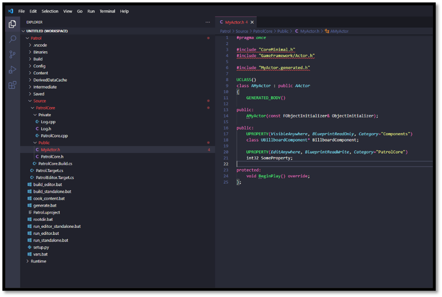
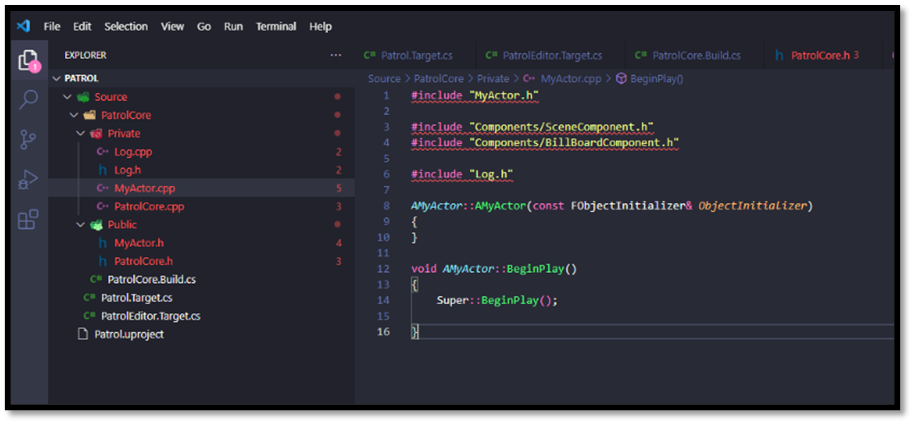
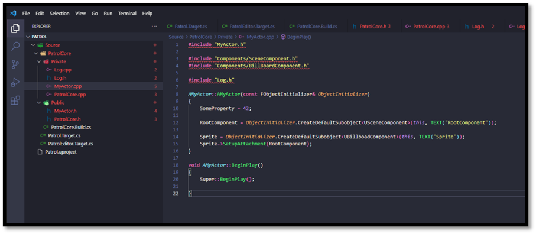
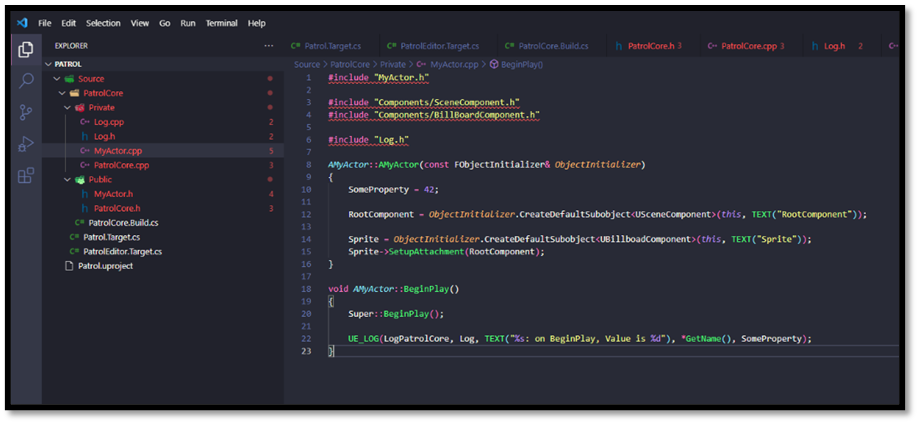
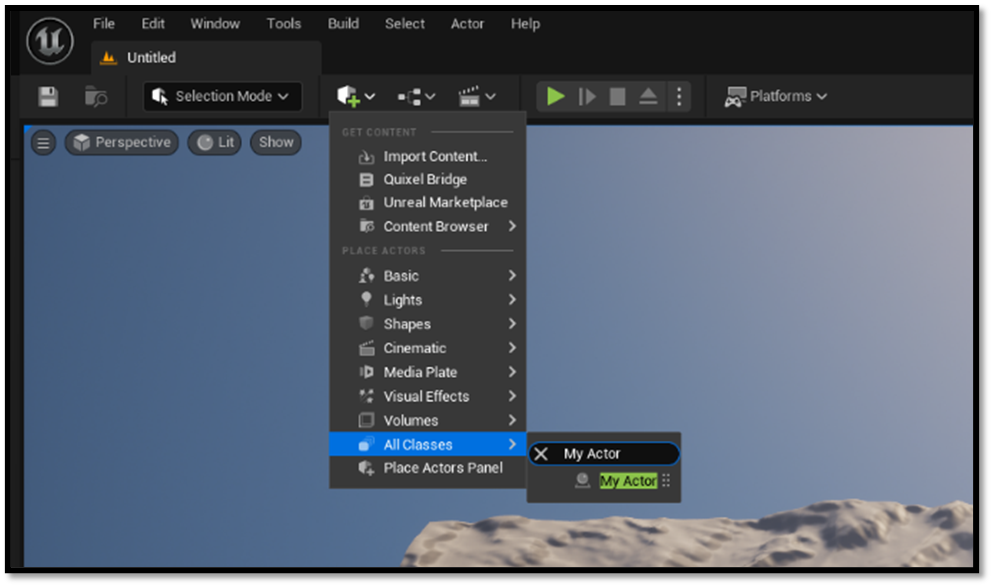

# Testing the setup

While having access to various development tools is exciting, their true value lies in practical application through testing otherwise this entire document is kind of useless. Let's consider a practical example within our project: introducing a new `AActor` instance. We'll attach a `UBillboardComponent` to it and initialize a property to a predefined value for demonstration purposes.

## Adding the Actor

- Add a new Public header file called MyActor.h to your Module
    - Use the snippet **uca** to autocomplete this file
-	Add a new component property for our `UBillboardComponent`
    -	Use **upc** snippet
-	Add a new editable property, so we can tweak a value
    -	Use **upe** snippet
-	Override `BeginPlay`
-	Declare a constructor
    -	Use **ufc** snippet

When complete our header file should look like this: 

- Add a new Private source fille call MyActor.cpp to your module
- Create the constructor
- Create the `BeginPlay` function
- Include required files

- Use the `FObjectInitializer` to create a root `USceneComponent`
- Use the `FObjectInitializer` to create a `UBillboardComponent`
- Attach the `UBillboardComponent` to the root `USceneComponent`
- Assign a default value to the editable property

- Include the modules `Log.h` file
- In `BeginPlay` use the snippet **ull** to add a log line
- Log the name of the `AActor` and the integer value of the property we created

## The iteration loop

When we would like to test a feature there is a simple iteration loop we can run to speed up our development cycle. A fast and efficient development iteration cycle holds immense value for software development teams across various industries. One of its primary advantages lies in providing a faster feedback loop. By shortening the time between development, testing, and implementation, teams can swiftly identify any issues, bugs, or inefficiencies in their code or features. This rapid feedback loop enables developers to make necessary improvements promptly, leading to higher-quality software products.

Moreover, an accelerated iteration cycle enhances the agility of development teams. In today's rapidly evolving technology landscape, the ability to quickly test and implement new features is essential for staying competitive. A fast iteration cycle allows teams to respond promptly to market demands, user feedback, and changing requirements. This agility enables companies to adapt their products swiftly, ensuring they remain relevant and meet the evolving needs of their users.

Shortening the development cycle also translates to reduced time to market. By delivering features and updates more rapidly, companies can gain a significant advantage over their competitors. Being able to introduce new features quickly can lead to increased market share, revenue, and customer satisfaction. Additionally, a rapid iteration cycle allows companies to capitalize on opportunities swiftly and respond effectively to competitive threats.

Furthermore, a fast iteration cycle fosters enhanced collaboration within development teams and across departments. By continuously integrating and testing new features, teams can identify potential conflicts, dependencies, or areas for improvement early in the development process. This collaborative approach promotes a culture of shared ownership and collective responsibility for the success of the product. It encourages cross-functional collaboration between developers, testers, designers, and other stakeholders, leading to more cohesive and well-rounded software solutions.

Finally, a fast and efficient iteration cycle cultivates a culture of continuous improvement. By regularly releasing updates and gathering feedback from users, teams can iteratively enhance and optimize their products based on real-world usage and data. This iterative approach enables teams to make incremental improvements over time, ensuring that the product evolves and remains competitive in the market. Ultimately, a fast iteration cycle is essential for accelerating innovation, improving product quality, and driving business success in today's dynamic and competitive environment.

Our development iteration loop looks as followed:

- Press CTRL + Tilde (~)
- Run `build_editor && run_editor`
- Check for any errors
    - If and only if there are errors
        - Fix compiler errors
        - Press CTRL + Tilde (~)
        - Press up arrow in the terminal
        - Press enter
- Rinse and repeat

## Testing our code

To ensure the effectiveness of our code, we should test it. We'll accomplish this by opening the Editor and placing an instance of our `AActor` within the scene. This step allows us to validate the functionality of our `AActor` implementation in a real-world environment.

Once the `AActor` is positioned within the scene, adjustments to its predefined properties can be made. Subsequently, initiating gameplay by pressing the play button enables close monitoring of the output window. Here, a logging functionality has been integrated within the code to present information regarding the `AActor`, encompassing its name and the property value.

To [conclude](./conclusion.md) ...